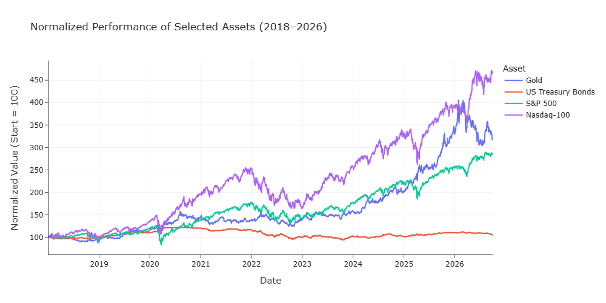
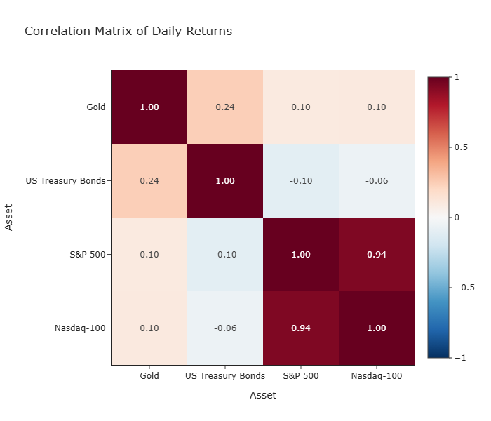
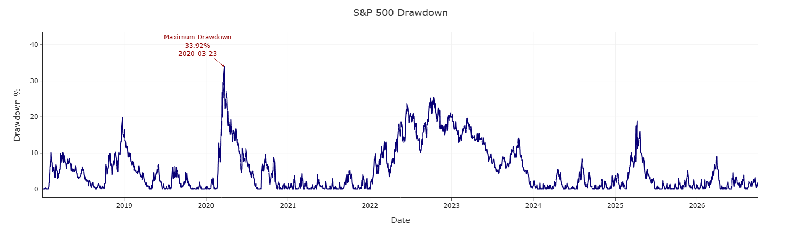

# Market Returns & Volatility Analysis

## Overview

This project analyzes the return and risk characteristics of the S&P 500 and extends the analysis to a multi-asset comparison including the Nasdaq-100, gold, and intermediate-term U.S. Treasury bonds.

The objective is to examine how different financial assets behave in terms of returns, volatility, drawdowns, correlations, risk-adjusted performance, and downside risk.

Historical market data is downloaded using `yfinance` and analyzed in Python using `pandas`, `NumPy`, `SciPy`, and `Plotly`.

---

## Assets Analyzed

The multi-asset analysis includes:

| Asset | Ticker | Asset Class |
|---|---|---|
| S&P 500 | `^GSPC` | U.S. Equities |
| Nasdaq-100 | `^NDX` | U.S. Growth / Technology Equities |
| Gold | `GC=F` | Commodity |
| iShares 7-10 Year Treasury Bond ETF | `IEF` | U.S. Treasury Bonds |

The analysis uses a common sample period beginning in 2018.  
Observations with missing prices across the selected assets are removed to ensure that return comparisons are based on synchronized trading dates.

---

## Analysis

### S&P 500

The first part of the project focuses on the S&P 500 and includes:

- Historical price evolution
- Simple and logarithmic returns
- Descriptive statistics
- Return distribution analysis
- Comparison with the normal distribution
- Rolling volatility
- Annualized volatility
- Drawdown and maximum drawdown
- Annualized volatility by calendar year

### Multi-Asset Analysis

The second part compares the four selected assets using:

- Normalized cumulative performance
- Annualized arithmetic return
- Annualized volatility
- Maximum drawdown
- Correlation of daily returns
- Sharpe ratio
- Historical Value at Risk (VaR)

---

## Methodology

Daily simple returns are calculated as

\[
R_t = \frac{P_t}{P_{t-1}} - 1
\]

Annualized arithmetic return is estimated using

\[
\mu_{\text{annual}} = 252 \cdot \bar{R}_{\text{daily}}
\]

and annualized volatility as

\[
\sigma_{\text{annual}} =
\sqrt{252}\,\sigma_{\text{daily}}
\]

Maximum drawdown measures the largest observed decline from a previous price peak:

\[
D_t = 1-\frac{P_t}{\max_{s\leq t} P_s}
\]

The Sharpe ratio is calculated as

$$
S =
\frac{E[R]-R_f}{\sigma}
$$

using a constant annual risk-free rate of **4%** as a simplifying assumption.

For historical Value at Risk, daily losses are defined as

\[
L_t=-R_t
\]

and the 95% historical VaR is estimated from the empirical loss distribution:

\[
VaR_{0.95}=F_L^{-1}(0.95)
\]

---

## Key Results

The analysis highlights substantial differences in the risk-return characteristics of the selected assets.

| Asset | Annualized Return | Annualized Volatility | Maximum Drawdown | Sharpe Ratio | 95% Daily VaR |
|---|---:|---:|---:|---:|---:|
| Gold | ~14.9% | ~17.6% | ~24.9% | ~0.61 | ~1.71% |
| IEF | ~0.8% | ~6.9% | ~23.9% | ~-0.46 | ~0.69% |
| S&P 500 | ~13.8% | ~19.2% | ~33.9% | ~0.52 | ~1.76% |
| Nasdaq-100 | ~20.6% | ~24.0% | ~35.6% | ~0.69 | ~2.41% |

> Annualized returns shown here are arithmetic annualizations of mean daily returns and should not be interpreted as CAGR.

---

## Key Visualizations

### Normalized Asset Performance



### Correlation Matrix



### S&P 500 Drawdown



---

## Main Findings

The **Nasdaq-100** generated the highest annualized arithmetic return during the sample period, but it also exhibited the highest volatility, maximum drawdown, and historical VaR. This illustrates the trade-off between higher historical returns and greater exposure to risk.

The **S&P 500** also produced strong returns while exhibiting somewhat lower volatility than the Nasdaq-100. However, the daily returns of both equity indices were highly correlated, with a correlation of approximately **0.94**, suggesting limited diversification between the two.

**Gold** displayed a much weaker relationship with U.S. equities. Its relatively low correlation with the S&P 500 and Nasdaq-100 suggests that it could contribute to diversification when combined with equity exposure.

**IEF** exhibited the lowest annualized volatility of the assets analyzed, but its average return during the sample period was also considerably lower. Under the assumed 4% risk-free rate, IEF produced a negative Sharpe ratio.

Overall, the analysis demonstrates why investment risk cannot be adequately described by a single measure. Volatility captures the dispersion of returns, drawdown measures losses relative to previous peaks, the Sharpe ratio evaluates return relative to volatility, and historical VaR describes downside risk using the empirical distribution of historical losses.

---

## Technologies

- Python
- pandas
- NumPy
- SciPy
- Plotly
- yfinance
- Jupyter Notebook

---

## Repository Structure

```text
market-returns-volatility-analysis/
│
├── notebooks/
│   └── market-returns-volatility.ipynb
│
├── images/
│
├── README.md
├── requirements.txt
└── .gitignore